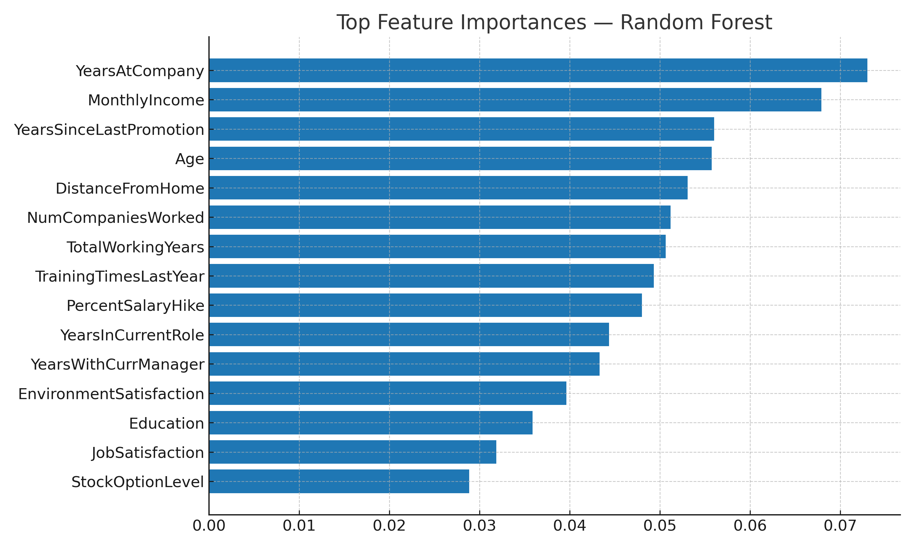
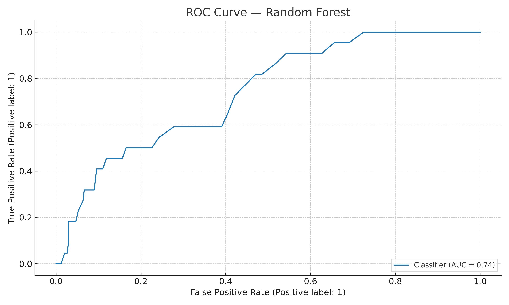
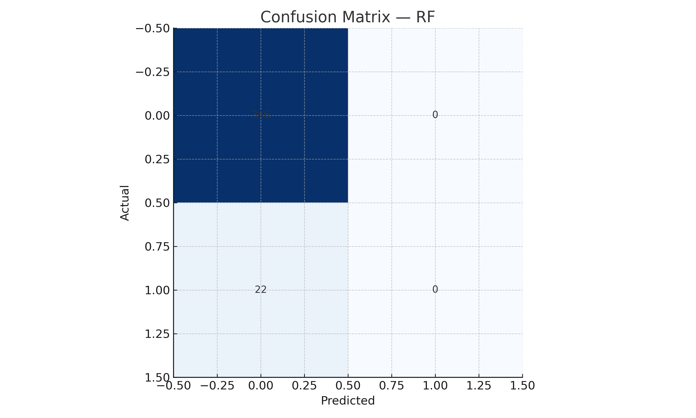

# 🧑‍💼 HR Attrition Prediction (Classification)

Predict whether an employee is at risk of **attrition** using job characteristics, compensation, and satisfaction metrics.  
This is a recruiter‑friendly case study with **clear storytelling**, **visible results**, and a **real‑data pipeline**.

---

## 🌍 Why it matters
Attrition drives **hiring costs**, **knowledge loss**, and **morale impact**. Predictive risk scoring helps HR focus retention actions (comp review, WLB, manager coaching).

---

## ❓ Problem
**Binary classification**: `Attrition = 1` if an employee is likely to leave, else `0`.

---

## 🛠️ Approach
- **Features**: tenure, job role, business travel, overtime, satisfaction, income, promotions, manager tenure, etc.
- **Models**: Logistic Regression (explainable) + Random Forest (robust baseline).
- **Evaluation**: Accuracy, Precision, Recall, F1, ROC AUC + diagnostic plots.
- **Explainability**: coefficients (logistic) + feature importances (RF).
- **Thresholding**: best‑F1 decision threshold to target top‑risk employees.

> The repo ships with a **sample dataset** for instant charts.  
> Run `python src/train_model.py` to download a **real dataset** (IBM HR Attrition mirrors) and retrain automatically.

---

## 📈 Results (preview)






---

## 📂 Project Structure
```
hr-attrition-prediction/
├── src/
│   ├── train_model.py                    # downloads real IBM HR dataset + trains
│   └── hr_attrition_prediction.ipynb     # curated notebook (story + previews)
├── data/
│   └── sample_hr_attrition.csv           # realistic sample (HR‑like)
├── results/
│   ├── metrics.json
│   ├── rf_feature_importance.csv
│   ├── logreg_coefficients.csv
│   ├── rf_feature_importance.png
│   ├── confusion_matrix_rf.png
│   ├── confusion_matrix_logreg.png
│   ├── roc_curve_rf.png
│   ├── pr_curve_rf.png
│   ├── attrition_risk_scored.csv
│   └── best_threshold.txt
├── README.md
├── .gitignore
└── LICENSE
```

---

## ▶️ How to Run
```bash
pip install pandas scikit-learn matplotlib
python src/train_model.py   # trains on real data if mirrors are up
```
Artifacts will be written to `results/`.

---

## ⚡ Skills Demonstrated
- Supervised ML (classification) with **scikit‑learn**
- Feature engineering & encoding (ColumnTransformer, OHE, scaling)
- Model evaluation (ROC AUC, F1, PR/ROC curves)
- Explainability (coefficients, feature importances)
- Reproducible project structure & storytelling

---

## 📜 License
MIT License — free to use and adapt.